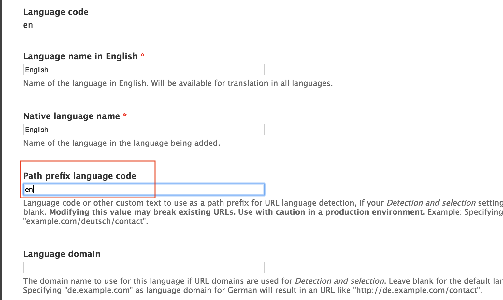

# Remove path prefix on default language

If your site is set to the default English language, you may end up with duplicates on your site:

* example.com
* example.com/en

To avoid errors and duplication of pages, you must go to the Languages options and remove the prefix of your default language \( /admin/config/regional/language \)

