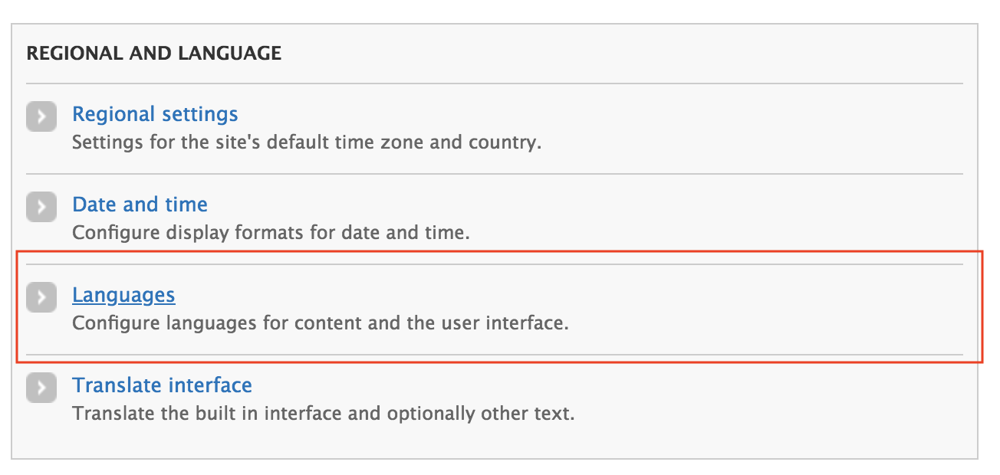
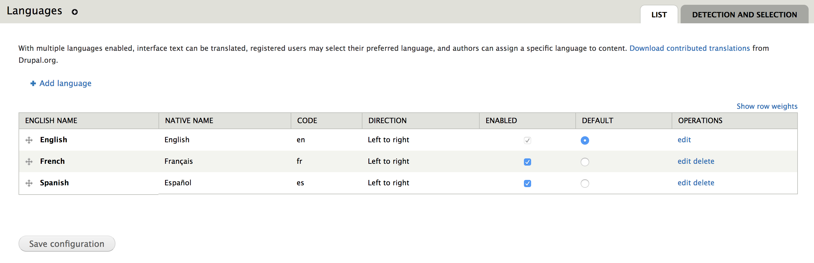
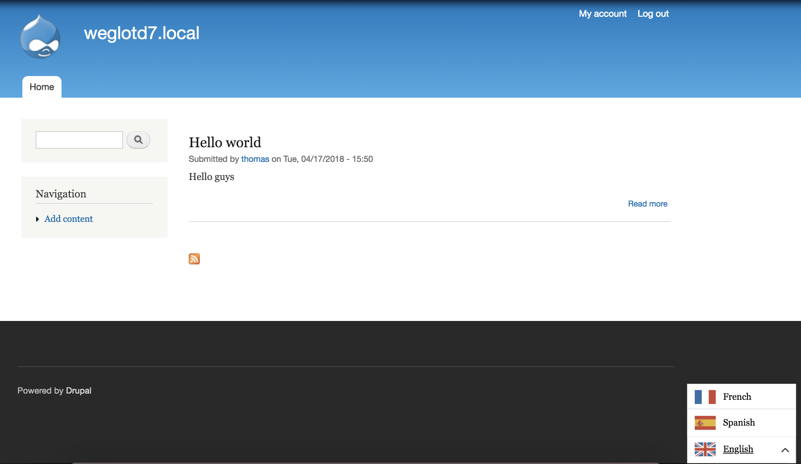

# Drupal - 7

## Requirements modules {#requirements-modules}

* Path
* Locale
* Composer Manager

## Getting started

### 1/ Installation

Install the module "Weglot Translate" from your Drupal admin dashboard

Copy / paste the [URL of the package](https://www.drupal.org/project/weglot) to install or download the module to include it directly.​

### 2/ Configure an API Key

Once you have activated the module, you can access the configuration of it directly via the administration menu.​

To be able to use the module, you need an API key that you can get by [creating an account](https://dashboard.weglot.com/register?origin=10).

### 3/ Configure Clean URLs

Weglot only works with cleans URLs. You must configure the path module.​​

### 4/ Configure Locale module

In order to translate your website, Weglot needs to know the original language of your site as well as the languages of the destinations.

You can do it going to configure your languages with the Local module.​

### 5/ Translate !

Finish ! You can go on your website. A language selector will appear at the bottom right.​

​

