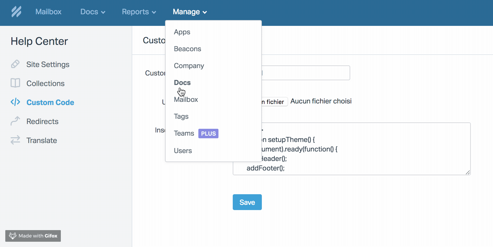
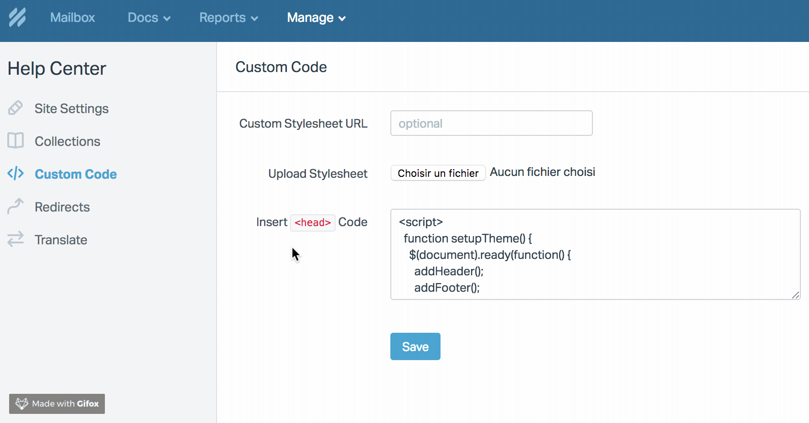

# Help Scout

## Getting started

Let's include Weglot's client code into your Help Scout Docs and get started with translations.

* Go to your Weglot dashboard \([https://dashboard.weglot.com/](https://dashboard.weglot.com/)\) and get your API key in the "Project settings" menu \(e.g. `wg_1234567897e2ea993d291b571c2ec93b0`\)
* Go to your Help Scout account, then click on "Manage" in the top left menu and select "Docs" \(if you can not see the "Manage" tab it means you do not have the permission to access it. Ask for more permissions or login with another account\)


* Select the Docs Site to be translated, then click on "Custom Code" on the left bar menu




* Copy the following code:

```text
<script type="text/javascript" src="https://cdn.weglot.com/weglot.min.js"></script>
<script>
	Weglot.setup({
	  api_key: 'YOUR_API_KEY',
	  originalLanguage: 'en',
	  destinationLanguages : 'fr,es',
	 });
</script>
```

Don't forget to replace `YOUR_API_KEY` with the API key you got earlier. Notice that the original language of your website is set through `originalLanguage` \(English in this example\), and that the additional languages you wish to provide are set through `destinationLanguages` \(French and Spanish in this example\).


The full list of language codes we support is available at [https://weglot.com/documentation/available-languages](https://weglot.com/documentation/available-languages)​


* Click in the Insert `<head>` Code field, go the very end, and paste the code. Then click on save.



Go to your Docs Site, a button has been added, you can switch the language. Manage and edit your translations in your Weglot account \([https://dashboard.weglot.com/translations/](https://dashboard.weglot.com/translations/)\). 

See the [Javascript](https://developers.weglot.com/integration-guides/javascript#initialization-code) documentation for more options. Feel free to contact us for any request or question \(support@weglot.com\).

