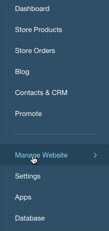

# Wix

## Getting started

* Go to your Weglot dashboard \([https://dashboard.weglot.com/](https://dashboard.weglot.com/)\) and get your API key in the "Project settings" menu \(e.g. `wg_1234567897e2ea993d291b571c2ec93b0`\) 
* Log in to your Wix dashboard, then on the left-side menu, go to `Manage Website` &gt; `Tracking & Analytics`




* Copy the following code:

```markup
<script type="text/javascript" src="https://cdn.weglot.com/weglot.min.js"></script>
<script>
	Weglot.setup({
	  api_key: 'YOUR_API_KEY',
	  originalLanguage: 'en',
	  destinationLanguages : 'fr,es',
	 });
</script>
```

Don't forget to replace `YOUR_API_KEY` with the API key you got earlier. Notice that the original language of your website is set through `originalLanguage` \(English in this example\), and that the additional  languages you wish to provide are set through `destinationLanguages` \(French and Spanish in this example\)


The full list of language codes we support is available at [https://weglot.com/documentation/available-languages](https://weglot.com/documentation/available-languages)​


* Click "New Tool" and "Custom" and paste the code. Make sure that you select "Load code on each new page" and click "Apply".


##  Adding a custom menu


